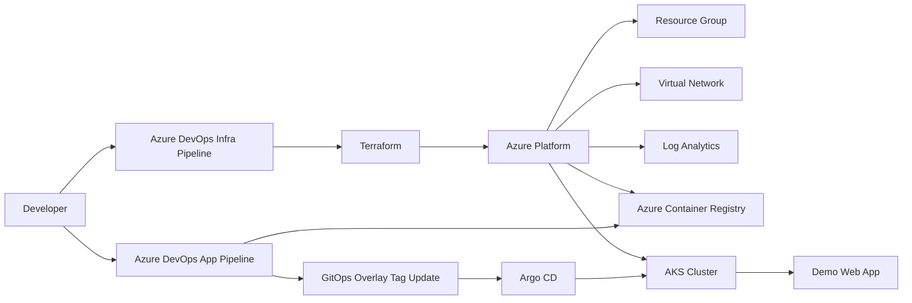

# Cloud Infrastructure with Terraform

This repository is a complete starter project for provisioning Azure infrastructure with Terraform, automating delivery through Azure DevOps, and deploying a real containerized workload to AKS with Argo CD.

## Included Components

- Terraform platform baseline for Azure resource group, virtual network, AKS subnet, Log Analytics, Azure Container Registry, and AKS
- Azure DevOps infrastructure pipeline for `fmt`, `validate`, `plan`, and gated `apply`
- Azure DevOps application pipeline for building the demo image, pushing it to ACR, and updating the GitOps manifest tag
- Argo CD bootstrap manifests using an app-of-apps pattern
- A demo web application container stored in `app/` and deployed from `gitops/`
- PowerShell helper scripts for state bootstrap, image publishing, AKS access, GitOps configuration, and Argo CD installation

## Architecture



## Repository Layout

```text
.
|-- app
|-- azure-pipelines.yml
|-- azure-pipelines-app.yml
|-- gitops
|-- scripts
`-- terraform
```

## Prerequisites

- Azure subscription with permissions to create AKS, ACR, networking, identities, and storage resources
- Azure DevOps project with an Azure Resource Manager service connection
- Terraform 1.7 or newer
- Azure CLI
- Docker
- kubectl
- Helm 3

## Quick Start

### 1. Create Terraform State Storage

```powershell
.\scripts\bootstrap-backend.ps1 -SubscriptionId <subscription-id>
```

Copy the output into `terraform\envs\dev\backend.hcl`.

### 2. Provision Azure Infrastructure

```powershell
cd terraform
terraform init -backend-config="envs/dev/backend.hcl"
terraform plan -var-file="envs/dev/terraform.tfvars"
terraform apply -var-file="envs/dev/terraform.tfvars"
```

Useful outputs after apply:

```powershell
terraform output resource_group_name
terraform output aks_cluster_name
terraform output acr_login_server
terraform output acr_name
```

### 3. Build and Push the Demo Image

You can do this locally once or let the application pipeline handle it after you push the repo.

```powershell
.\scripts\publish-demo-image.ps1 `
  -AcrLoginServer <terraform-output-acr-login-server> `
  -ImageTag latest
```

This builds the app from `app/`, pushes it to ACR, and updates the dev GitOps overlay to use that image.

### 4. Configure GitOps and Bootstrap Argo CD

```powershell
.\scripts\bootstrap-argocd.ps1 `
  -AksResourceGroup <terraform-output-resource-group> `
  -AksClusterName <terraform-output-cluster-name> `
  -GitOpsRepoUrl https://dev.azure.com/<org>/<project>/_git/<repo> `
  -AcrLoginServer <terraform-output-acr-login-server> `
  -ImageTag latest
```

### 5. Verify the Platform

```powershell
kubectl get nodes
kubectl get applications -n argocd
kubectl get svc -n argocd
kubectl get pods -n demo-platform
kubectl get svc -n demo-platform
```

## Pipelines

### Infrastructure Pipeline

The infrastructure pipeline lives in `azure-pipelines.yml` and is intended for Terraform changes only. Update these variables before using it:

- `azureServiceConnection`
- `tfStateResourceGroup`
- `tfStateStorageAccount`
- `tfStateContainer`
- `tfStateKey`

The `Apply` stage targets the Azure DevOps environment `aks-platform-dev`, so you can add approval gates there.

### Application Pipeline

The application pipeline lives in `azure-pipelines-app.yml` and does three things on `main`:

1. Builds the demo container image from `app/`
2. Pushes the image to the ACR created by Terraform
3. Updates `gitops/workloads/demo/overlays/dev/kustomization.yaml` with the new image tag and commits that change back to `main`

It uses the same backend variables as the infrastructure pipeline so it can read `terraform output` values from remote state.

## Helper Scripts

- `scripts/bootstrap-backend.ps1`: creates the remote Terraform state storage account and container
- `scripts/connect-aks.ps1`: fetches AKS admin kubeconfig
- `scripts/publish-demo-image.ps1`: builds and pushes the demo image to ACR
- `scripts/set-demo-image.ps1`: updates the GitOps overlay image repository and tag
- `scripts/configure-gitops.ps1`: updates Argo CD repo URLs and the demo image repository
- `scripts/bootstrap-argocd.ps1`: installs Argo CD and applies the root application

## Notes

- The AKS module now assigns `AcrPull` to the kubelet identity, which is the identity that actually pulls images from ACR.
- The current machine did not have Terraform or Azure CLI installed, so the repository was validated with Kubernetes manifest rendering and PowerShell parsing, but not with a live Azure deployment.
- The first successful image push should happen before expecting the demo workload to become healthy in AKS.
